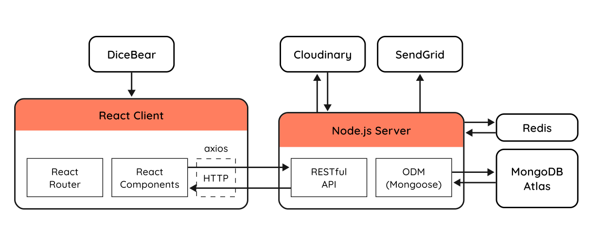
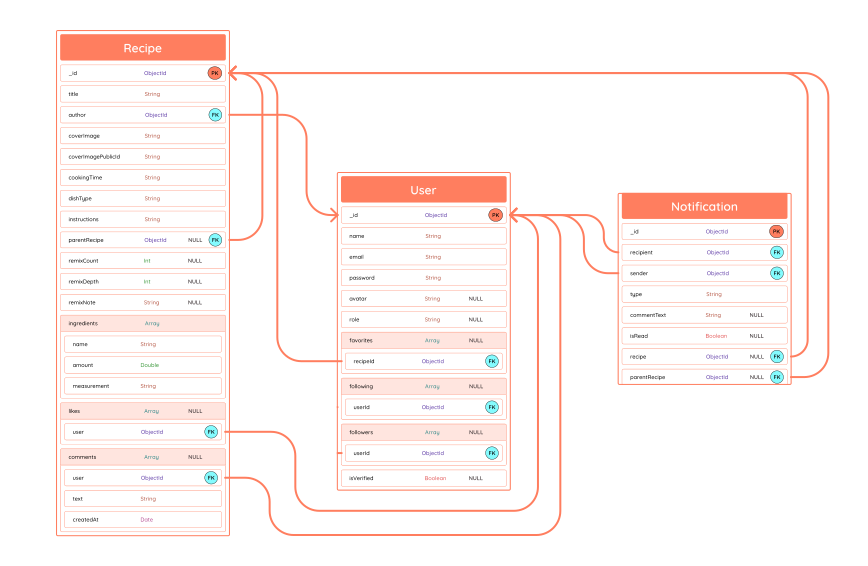
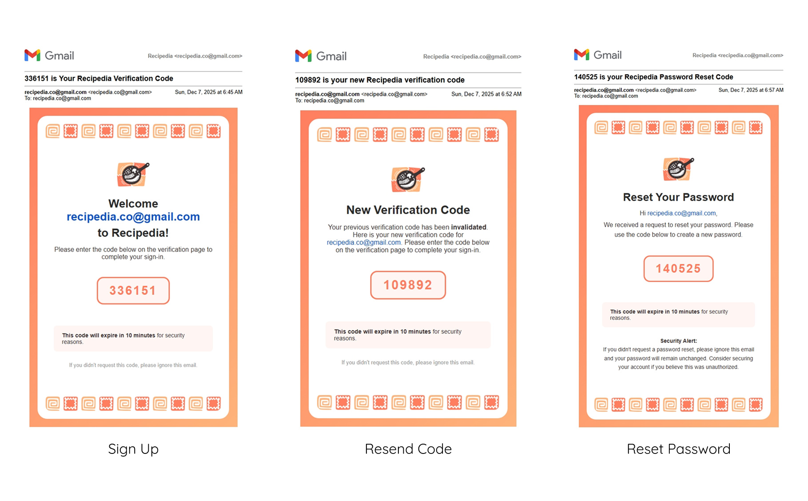

# Recipedia Backend API

The backend server for the Recipedia application. This RESTful API handles user authentication, recipe management, image processing, and email notifications.

## Key Features

- **Modern UI/UX:** Built with Shadcn UI (Radix Primitives) and Tailwind CSS v4 for a polished look.
- **Data Visualization:** Interactive charts using Recharts and powerful data tables via TanStack Table.
- **Utilities:** Export recipes to PDF or Image.
- **Robust Forms:** Type-safe form handling with React Hook Form and Zod validation.
- **Responsive:** Fully optimized for mobile, tablet, and desktop devices.

## API Documentation

This project uses Swagger for API documentation. You can access the interactive docs at:
`https://recipedia-backend-6gp7.onrender.com/api-docs`

## System Architecture



## NoSQL Database Design



## Tech Stack

### Core & Runtime


### Framework


### Database


### Authentication


### Storage & Media Processing


### Services & Documentation


### Deployment


## Email Preview



## Installation

### Clone repo

```bash
git clone https://github.com/hquangthinh13/recipedia-backend.git

cd recipedia-backend
```

### Install dependencies

```bash
npm install
```

## Environment Variables

```env
 # Server Configuration
    PORT=5000
    NODE_ENV=development

    # Database
    MONGO_URI=mongodb+srv://<your_connection_string>

    # Authentication
    JWT_SECRET=your_super_secret_key
    JWT_EXPIRE=30d

    # Cloudinary (Image Upload)
    CLOUDINARY_CLOUD_NAME=your_cloud_name
    CLOUDINARY_API_KEY=your_api_key
    CLOUDINARY_API_SECRET=your_api_secret

    # SendGrid (Email Service)
    SENDGRID_API_KEY=your_sendgrid_api_key
    EMAIL_FROM=noreply@recipedia.com

    # Upstash
    UPSTASH_REDIS_REST_URL=your_upstash_redis_rest_url
    UPSTASH_REDIS_REST_TOKEN=your_upstash_redis_token
```

## Run Project

### Development

```bash
npm run dev
```

### Production

```bash
npm run build
npm start
```
